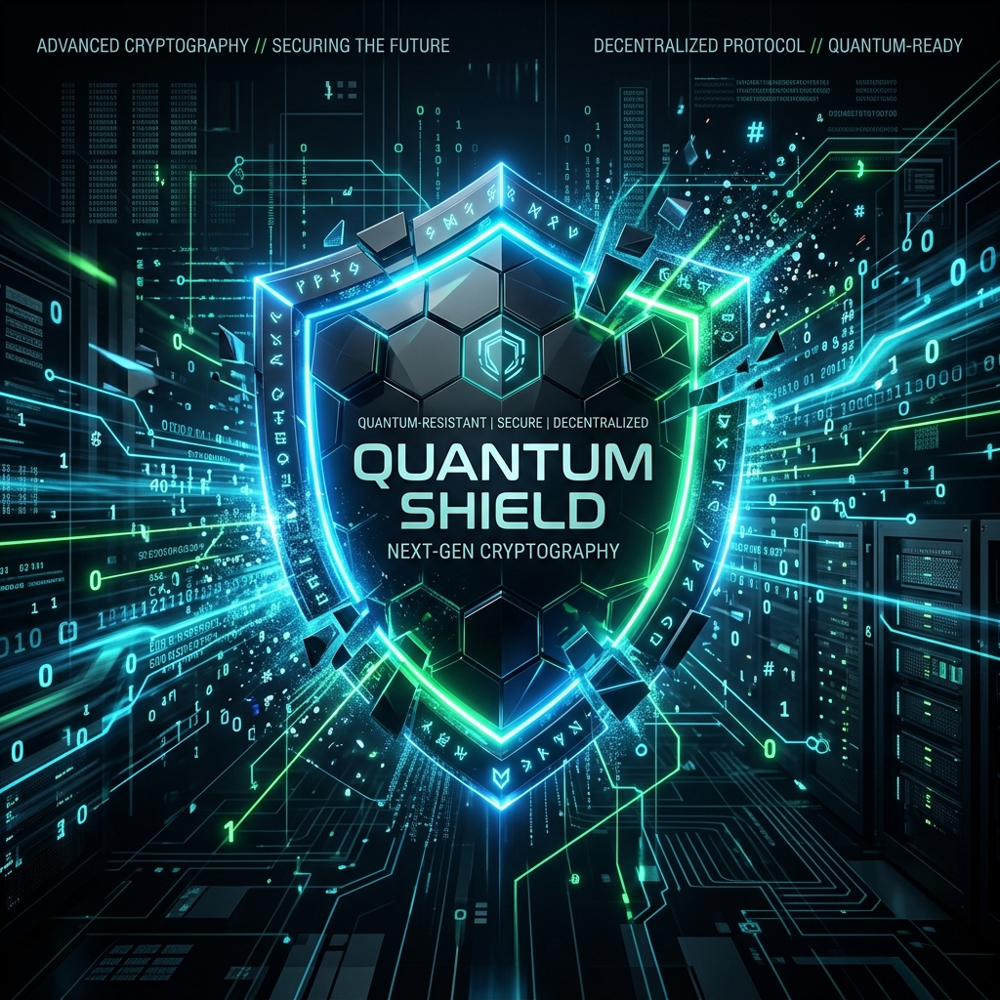

<p align="center">
  
</p>

<p align="center">
  
  
  
  
  
</p>

<h1 align="center">🛡️ ObsidianQ</h1>
<p align="center"><strong>Post-Quantum Cryptography for Java, powered by Rust.</strong></p>
<p align="center">
  A quantum-safe Key Encapsulation Mechanism (KEM) SDK implementing<br/>
  <strong>NIST FIPS 203 (ML-KEM-768 / CRYSTALS-Kyber)</strong> with zero-copy JNI,<br/>
  off-heap memory safety, and drop-in JCA compliance.
</p>

---

## ⚡ Quickstart — 4 Lines to Quantum Safety

```java
import java.security.*;
import javax.crypto.KEM;
import com.obsidianq.jce.ObsidianQProvider;

// Register once
Security.addProvider(new ObsidianQProvider());

// Generate a quantum-safe keypair
KeyPairGenerator kpg = KeyPairGenerator.getInstance("Kyber768", "ObsidianQ");
KeyPair kp = kpg.generateKeyPair();

// Encapsulate — Bob creates a shared secret using Alice's public key
KEM kem = KEM.getInstance("ML-KEM-768", "ObsidianQ");
KEM.Encapsulator enc = kem.newEncapsulator(kp.getPublic());
KEM.Encapsulated encapsulated = enc.encapsulate();
SecretKey bobSecret = encapsulated.key();           // 32-byte AES key
byte[] ciphertext = encapsulated.encapsulation();   // Send to Alice

// Decapsulate — Alice recovers the same shared secret
KEM.Decapsulator dec = kem.newDecapsulator(kp.getPrivate());
SecretKey aliceSecret = dec.decapsulate(ciphertext);

// bobSecret == aliceSecret ✅
```

> **That's it.** No custom APIs. No Rust knowledge required. Standard Java.

---

## 🔬 Deep Dive: What is ML-KEM (FIPS 203)?

In August 2024, the National Institute of Standards and Technology (NIST) formalized **FIPS 203**, standardizing **ML-KEM** (formerly known as CRYSTALS-Kyber). 

Traditional cryptography (like RSA and Elliptic Curve) relies on the difficulty of factoring prime numbers or solving discrete logarithms. A sufficiently large quantum computer running **Shor's Algorithm** will break these mathematical foundations in seconds.

**ML-KEM uses Lattice-Based Cryptography**, specifically a problem called **Module Learning with Errors (MLWE)**.
Instead of prime factorization, the math involves finding the shortest vector in a multi-dimensional lattice grid, combined with intentional, structured mathematical "noise." To date, no quantum algorithm (nor classical algorithm) has been discovered that can efficiently solve MLWE.

ObsidianQ specifically implements **ML-KEM-768**, which maps to NIST Security Level 3 (equivalent to the strength of AES-192), making it the gold standard for enterprise forward secrecy.

---

## 💀 The Java Garbage Collection Vulnerability

Why not just write the ML-KEM math in pure Java using BouncyCastle? **Memory Safety.**

When you perform cryptographic operations in pure Java, your `byte[]` arrays containing highly sensitive Private Keys and Shared Secrets are allocated on the **JVM Heap**. 
- The Garbage Collector (GC) moves these objects around, leaving invisible, uncontrolled ghost copies of your private keys across RAM.
- When an object goes out of scope, it is *not deleted* immediately. It waits for a GC pause, meaning your keys linger in memory indefinitely.
- If an attacker triggers a heap dump (`.hprof`) or scrapes the server's RAM via a side-channel vulnerability, your post-quantum keys are exposed.

### How ObsidianQ Fixes It: Zero-Copy JNI
ObsidianQ moves the cryptographic math completely off the JVM heap.

1. **Direct Allocation**: Java allocates a `DirectByteBuffer` which exists in native OS memory, outside the JVM's control.
2. **Zero-Copy**: The memory address pointer is passed directly to the Rust engine (`core-rust`). No bytes are copied.
3. **Hardened Zeroization**: Rust executes the constant-time NTT math. The exact microsecond the operation finishes, ObsidianQ triggers a native `zeroize` command, deterministically overwriting the native RAM with zeroes before the function even returns to Java. 

*Your keys never touch the Java Heap.*

---

## 💼 Real-World Use Cases

- **"Store Now, Decrypt Later" Defense**: Nation-state actors are recording encrypted web traffic today, waiting for quantum computers to mature so they can decrypt it tomorrow. Upgrading your TLS/VPN handshakes with ObsidianQ provides immediate Forward Secrecy.
- **Financial HSMs**: High-frequency trading and core banking systems can utilize ObsidianQ for exchanging wrapping keys.
- **Spring Boot Microservices**: Secure internal network communication (mTLS) between microservices using ML-KEM key exchanges.

---

## 📦 Installation

### Maven (via JitPack)

> [!WARNING]
> **JitPack Limitations (Linux Only Builds)**
> JitPack builds libraries inside Ubuntu Linux containers. This means that when JitPack compiles ObsidianQ from source, it will *only* compile the Linux Native Library (`libobsidian_core.so`). 
> 
> If you are developing on **Windows** or **macOS** and try to run the JitPack-provided dependency, you will get an `UnsatisfiedLinkError` because the `.dll` or `.dylib` will be missing from the packaged JAR.
>
> **How to fix this on Windows/Mac:**
> 1. We highly recommend downloading the pre-compiled `obsidianq-sdk-1.1.0.jar` directly from the [GitHub Releases page](https://github.com/Sarvesh2005-code/obsidianQ/releases). The pre-compiled releases are built via GitHub Actions and contain the native libraries for all three major operating systems (Windows `.dll`, Mac `.dylib`, Linux `.so`). You can manually add this JAR to your project's build path.
> 2. Alternatively, you can [Build From Source](#build-from-source) directly on your machine.

Add the JitPack repository to your `pom.xml`:
```xml
<repositories>
    <repository>
        <id>jitpack.io</id>
        <url>https://jitpack.io</url>
    </repository>
</repositories>
```

Add the ObsidianQ dependency:
```xml
<dependency>
    <groupId>com.github.Sarvesh2005-code</groupId>
    <artifactId>obsidianQ</artifactId>
    <version>v1.1.0</version>
</dependency>
```

### Gradle (via JitPack)

Add it in your root `build.gradle` at the end of repositories:
```gradle
allprojects {
    repositories {
        ...
        maven { url 'https://jitpack.io' }
    }
}
```

Add the dependency:
```gradle
dependencies {
    implementation 'com.github.Sarvesh2005-code:obsidianQ:v1.1.0'
}
```

### Build From Source
```bash
# Prerequisites: Rust (stable), Java 21+, Maven 3.9+

git clone https://github.com/Sarvesh2005-code/obsidianQ.git
cd obsidianQ
mvn clean compile test-compile
```

### Run the Integrity Test
```bash
java -cp "target/classes;target/test-classes" com.obsidianq.JCAIntegrityTest
```

---

## 🗺️ Roadmap & Future Plans

- [x] **Phase 1:** FIPS 203 Core Math (NTT, CBD, SHAKE, IND-CPA, bit-packing)
- [x] **Phase 2:** Java 21 `javax.crypto.KEM` integration & cross-platform CI
- [x] **Phase 3:** Constant-time verification & ASN.1 X.509/PKCS#8 Key Wrapping
- [x] **Phase 4:** Memory zeroization hardening & dynamic rejection sampling (`v1.1.0`)
- [ ] **Phase 5:** Publish `obsidianq-spring-boot-starter` for seamless web integration
- [ ] **Phase 6:** Publish directly to Maven Central (`repo1.maven.org`)
- [ ] **Phase 7:** Support for ML-KEM-512 and ML-KEM-1024

---

## 🤝 Contributing & License

See [CONTRIBUTING.md](CONTRIBUTING.md) for guidelines. Security-critical contributions require extra scrutiny — see [SECURITY.md](SECURITY.md).
Licensed under the [MIT License](LICENSE).

<p align="center">
  <strong>Built with 🦀 Rust + ☕ Java | Defending against quantum threats today.</strong>
</p>
