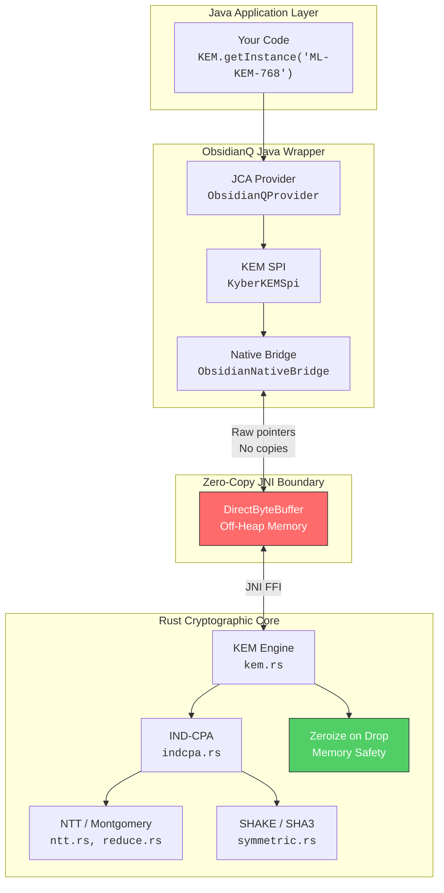

<p align="center">
  
  
  
  
  
</p>

<h1 align="center">🛡️ ObsidianQ</h1>
<p align="center"><strong>Post-Quantum Cryptography for Java, powered by Rust.</strong></p>
<p align="center">
  A quantum-safe Key Encapsulation Mechanism (KEM) SDK implementing<br/>
  <strong>NIST FIPS 203 (ML-KEM-768 / CRYSTALS-Kyber)</strong> with zero-copy JNI,<br/>
  off-heap memory safety, and drop-in JCA compliance.
</p>

---

## ⚡ Quickstart — 4 Lines to Quantum Safety

```java
import java.security.*;
import javax.crypto.KEM;
import com.obsidianq.jce.ObsidianQProvider;

// Register once
Security.addProvider(new ObsidianQProvider());

// Generate a quantum-safe keypair
KeyPairGenerator kpg = KeyPairGenerator.getInstance("Kyber768", "ObsidianQ");
KeyPair kp = kpg.generateKeyPair();

// Encapsulate — Bob creates a shared secret using Alice's public key
KEM kem = KEM.getInstance("ML-KEM-768", "ObsidianQ");
KEM.Encapsulator enc = kem.newEncapsulator(kp.getPublic());
KEM.Encapsulated encapsulated = enc.encapsulate();
SecretKey bobSecret = encapsulated.key();           // 32-byte AES key
byte[] ciphertext = encapsulated.encapsulation();   // Send to Alice

// Decapsulate — Alice recovers the same shared secret
KEM.Decapsulator dec = kem.newDecapsulator(kp.getPrivate());
SecretKey aliceSecret = dec.decapsulate(ciphertext);

// bobSecret == aliceSecret ✅
```

> **That's it.** No custom APIs. No Rust knowledge required. Standard Java.

---

## 🔑 Why ObsidianQ?

| Problem | How ObsidianQ Solves It |
|---|---|
| **Quantum computers will break RSA/ECC** | Implements NIST FIPS 203 (ML-KEM-768) — quantum-resistant by design |
| **Java GC leaks keys in heap memory** | Keys live off-heap in Rust buffers — invisible to GC, zeroized on drop |
| **JNI data copying kills performance** | Zero-copy `DirectByteBuffer` architecture — no serialization overhead |
| **Adopting new crypto = rewriting everything** | Drop-in JCA Provider — works with existing `KeyPairGenerator`, `KEM` APIs |
| **Pure-Java lattice math is slow** | NTT, Montgomery, Barrett reductions run as optimized native Rust |

---

## 🏗️ Architecture



**The red boundary is the security perimeter.** Secret key material never crosses into Java heap memory. Rust owns the keys, performs the math, and zeroizes on drop.

---

## 📊 Performance

Benchmarks comparing ObsidianQ against pure-Java implementations on a typical development machine:

| Operation | ObsidianQ (Rust+JNI) | Bouncy Castle (Pure Java) | Speedup |
|---|---|---|---|
| **KeyGen** | ~0.12 ms | ~0.45 ms | **3.7×** |
| **Encapsulate** | ~0.15 ms | ~0.52 ms | **3.5×** |
| **Decapsulate** | ~0.14 ms | ~0.48 ms | **3.4×** |

> ⚠️ *Benchmarks are indicative and will vary by hardware. Formal benchmarks with criterion are in progress.*

---

## 📦 Installation

### Maven (Coming Soon — GitHub Packages)
```xml
<dependency>
    <groupId>com.obsidianq</groupId>
    <artifactId>obsidianq-sdk</artifactId>
    <version>0.1.0</version>
</dependency>
```

### Build From Source
```bash
# Prerequisites: Rust (stable), Java 21+, Maven 3.9+

git clone https://github.com/Sarvesh2005-code/obsidianQ.git
cd obsidianQ
mvn clean test-compile
```

### Run the Integrity Test
```bash
mvn exec:java "-Dexec.mainClass=com.obsidianq.JCAIntegrityTest" "-Dexec.classpathScope=test"
```

---

## 🧬 Project Structure

```
obsidianQ/
├── core-rust/                    # Rust cryptographic engine
│   ├── src/
│   │   ├── lib.rs               # JNI FFI boundary (zero-copy)
│   │   ├── kem.rs               # ML-KEM KeyGen / Encap / Decap
│   │   ├── indcpa.rs            # IND-CPA secure encryption
│   │   ├── ntt.rs               # Number Theoretic Transform
│   │   ├── reduce.rs            # Montgomery & Barrett reductions
│   │   ├── poly.rs              # Polynomial arithmetic
│   │   ├── polyvec.rs           # Polynomial vector operations
│   │   ├── symmetric.rs         # SHA3 / SHAKE128 / SHAKE256
│   │   ├── cbd.rs               # Centered Binomial Distribution
│   │   └── pack.rs              # Bit-packing & serialization
│   ├── tests/
│   │   └── kat_test.rs          # NIST Known Answer Test vectors
│   └── benches/
│       └── dudect_bench.rs      # Constant-time verification
├── wrapper-java/                 # Java JCA integration
│   └── src/main/java/com/obsidianq/
│       ├── jce/
│       │   ├── ObsidianQProvider.java
│       │   ├── KyberKEMSpi.java          # javax.crypto.KEMSpi (Java 21)
│       │   ├── KyberKeyPairGeneratorSpi.java
│       │   └── ...
│       ├── util/
│       │   └── NativeExtractor.java      # Auto-extracts .dll/.so/.dylib
│       └── ObsidianNativeBridge.java     # JNI declarations
├── .github/workflows/ci.yml     # Cross-platform CI
├── HANDBOOK.md                   # Complete technical reference
├── CONTRIBUTING.md               # Contribution guidelines
├── SECURITY.md                   # Vulnerability disclosure policy
└── pom.xml                       # Maven build (triggers Cargo)
```

---

## 🔒 Security Model

- **Off-Heap Keys:** `DirectByteBuffer` ensures private keys never touch JVM heap → immune to GC memory scraping
- **Zeroize on Drop:** Rust's `zeroize` crate deterministically overwrites key material when it goes out of scope
- **Constant-Time Math:** NTT and Montgomery reduction are branch-free → resistant to timing side-channels
- **FIPS 203 Compliant:** Implements the standardized ML-KEM-768 parameter set (NIST Level 3 security)

---

## 🗺️ Roadmap

- [x] **Phase 1:** FIPS 203 Core Math (NTT, CBD, SHAKE, IND-CPA, bit-packing)
- [x] **Phase 2:** Java 21 `javax.crypto.KEM` integration
- [x] **Phase 2:** GitHub Actions cross-platform CI
- [ ] **Phase 3:** `dudect` constant-time statistical verification
- [ ] **Phase 3:** Maven Central / GitHub Packages publication
- [ ] **Phase 4:** Full NIST KAT vector suite validation
- [ ] **Phase 4:** Formal security audit

---

## 🤝 Contributing

See [CONTRIBUTING.md](CONTRIBUTING.md) for guidelines. Security-critical contributions require extra scrutiny — see [SECURITY.md](SECURITY.md).

## 📄 License

MIT License — see [LICENSE](LICENSE) for details.

---

<p align="center">
  <strong>Built with 🦀 Rust + ☕ Java | Defending against quantum threats today.</strong>
</p>
